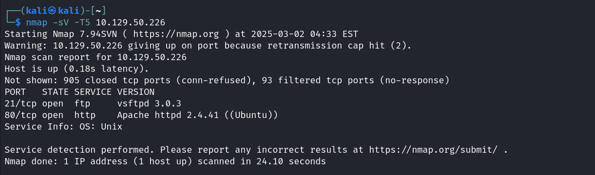
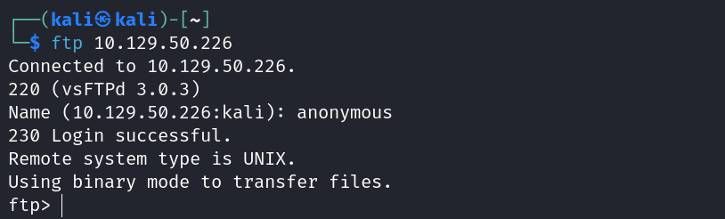
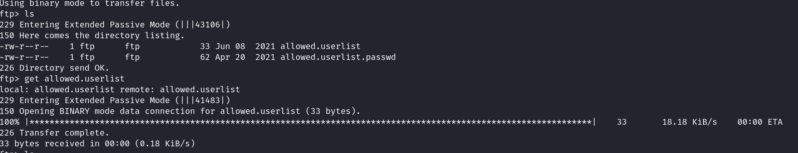
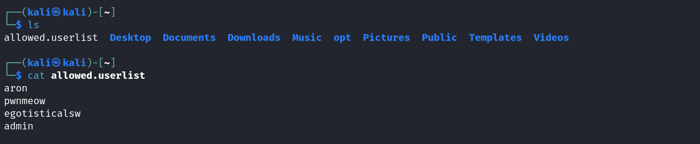
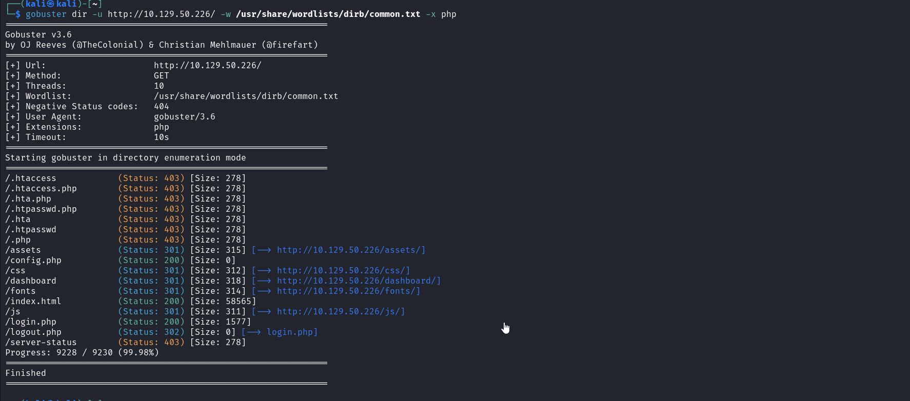
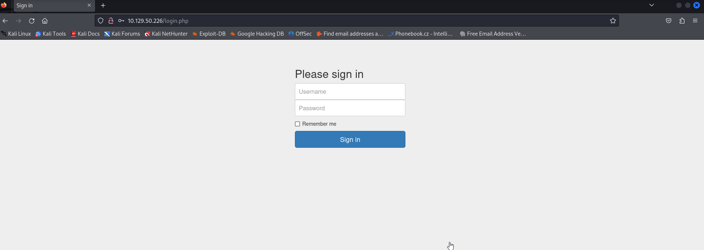
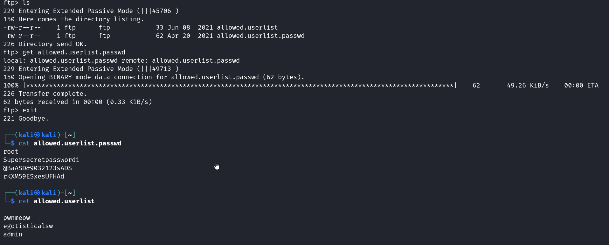
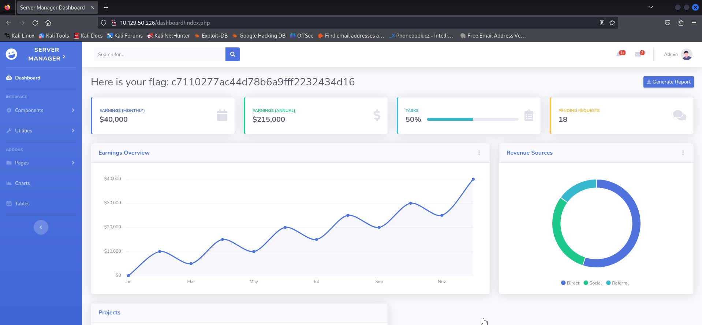

This is a very easy difficulty ctf from tier 1 of starting point.
based on ftp i think

Task1 is a theory question on what swithc employes scanning defaults scripts which is -sC.

task 2 requires us to find the service running on port 21.

task  3 is to find the code returned to us for 'anonymous login allowed' message:

task 4 is to login to ftp server anonymously:

task 5: we use get command to download the files from FTP server.

task 6:

from these usernames, the higher privileage username seem's like the obvious 'admin' username.

task7:
in our nmap scan earlier for the version we also saw an appache http server running on port 80.

task8:
The switch used to search for specific file extensions in gobuster is -x.

task9:
We use gobuster to search for the files with .php

Now to find the flag.
we know that there exists a login page. So we go to the site http://10.129.50.226/login.php

We need username and password. If we recall, we had got a file allowed.userlist from ftp server. We had a password file in that server too. So we go and install that. Therby getting username and password.

we have the last username as admin and the last password in the password file would be it's password.

We are redirected to a site. There the flag is given. Therefore flag obtained.