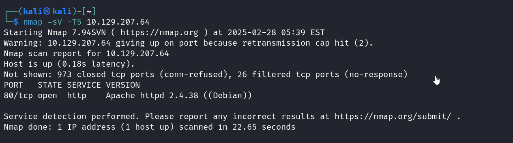
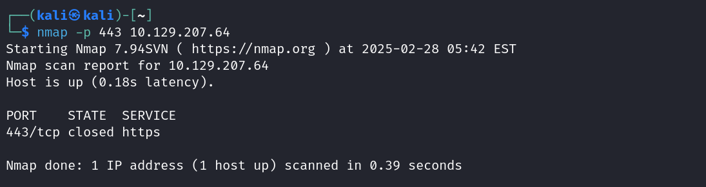
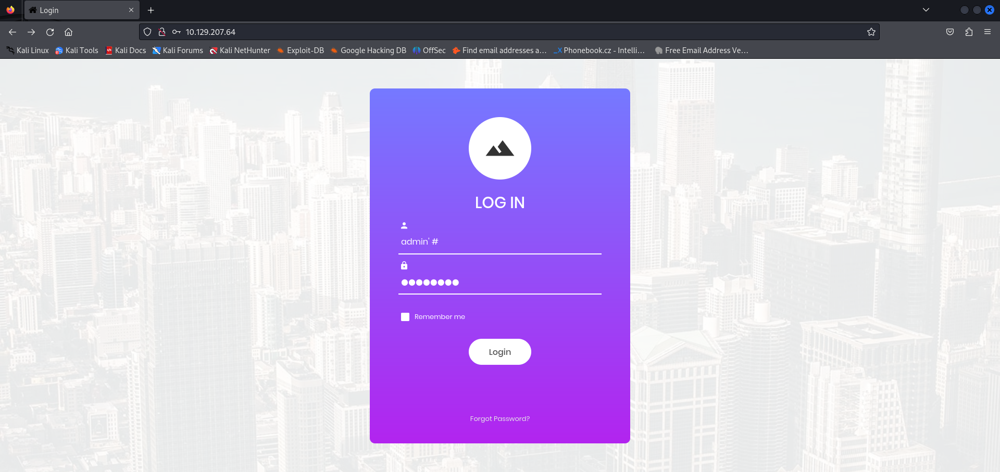
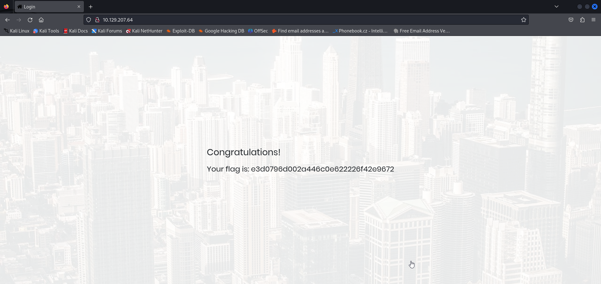

This is the appointment CTF from hack the box tier 1 starting point. This has difficulty very easy.
IT's based on Databse and sql injection.

Task 1,2,3 are theory questions.

Task 4 asks us the service and version that's running on port 80.
Through a nmap scan we can find that.

Task 5 asks us the specific port of https which is port 443.

Task 6,7,8,9 are theory questions.

task 10 is to use sql injection to enter username and put # after it making the password part a comment allowing access to a user without the password.
We can do this through browser or through the terminal itself. I've done both.
</n>
<u>Browser</u>
Simply enter the username as admin'#

Then after login we get the page...

</n>
<u>Terminal</u>
User "curl" and put the username=admin'#
