This is the Archetype CTF from tier 2 starting point.
It's based on mysql, smb ,powershell...

Let's first connect to the network and check if the system is running.
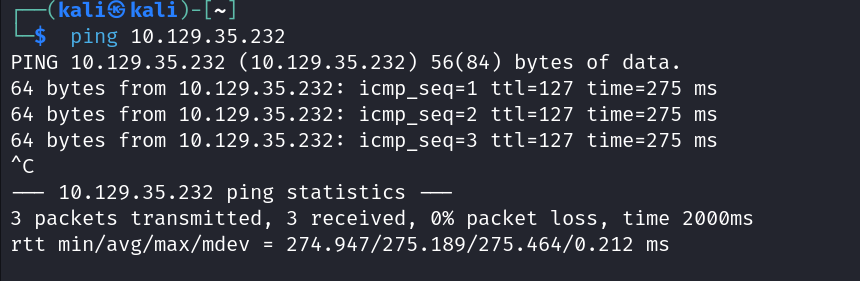
As we can see the ping is succesfull so we know our machine is up and running.

task1:
Our task is to find the TCP port hosting a database service. On performing a nmap scan we see,
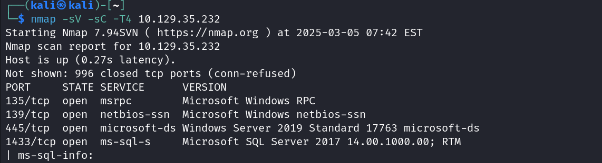
Port 1433 is running a ms-sql-s which is a databse service. Therefore the port 1433 is the answer for task1.

task2:
First we list out the avaiable shares on the target machine using smbclient.
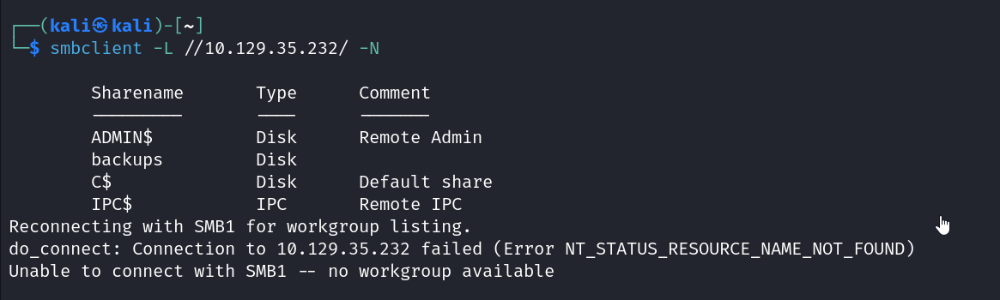
On listing it out we can see that there are three admin shares (the ones that end with $).
The task is to find the non-administrative share. The only non admin share is 'backups'.

task3:
To do this we fist connect to our smbserver using smbclient. Then we try to enumerate the shares. We can't enumerate the admin shares but the backups share is possible.

On listing the files in it we see something that looks like a configuration file. Let's get that file.
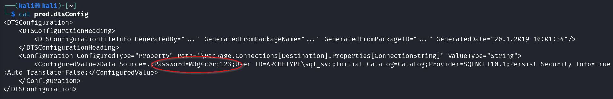
On reading the contents we notice a "password=" part. There we get the password we need.

task4:
In impacket scripts, the mssqlclient.py script is the one which can be used to connect to a SQL server.
We can use either python3 to manually open the script or we can use impacket-mssqlclient to run the script.
I've used the latter.
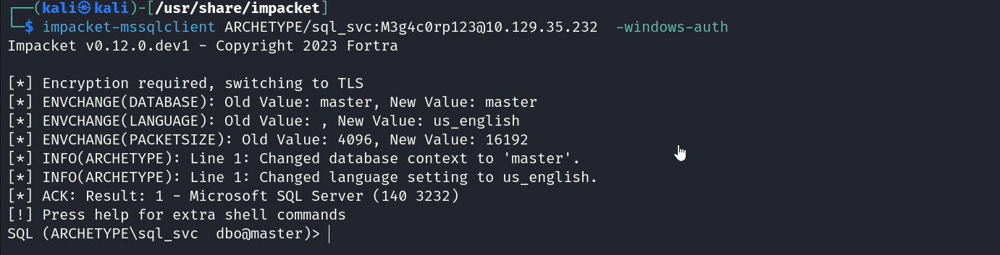
Ensure that when typing the username it will have a / instead of \ . The data we read from the configuration file had the username as ARCHETYPE\sql_svc but the backslash in this will cause the process to stop. 

task5:
The xp_cmdshell is a procedure in SQL that allows you to spawn a windows command shell and run windows system commands.
Let's try running a command through it.
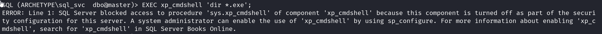
We see that the xp_cmdshell isn't activated. Therefore we need to use sp_configure to activate it.
Using a guide i found online ( https://learn.microsoft.com/en-us/sql/database-engine/configure-windows/xp-cmdshell-server-configuration-option?view=sql-server-ver16 )
I was able to activate xp_cmdshell.
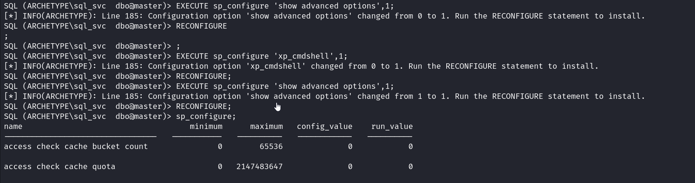
As we can see at the bottom of the table, it is indeed activated.
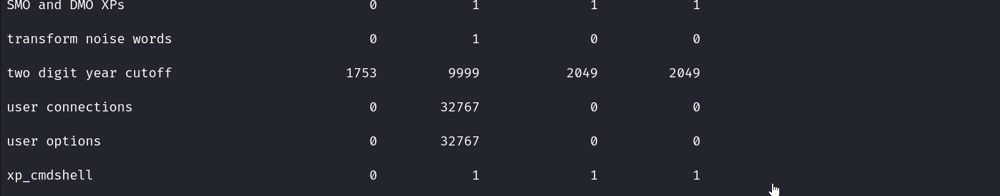
Let's try running a command.
I've tried listing the directories in the current directory.
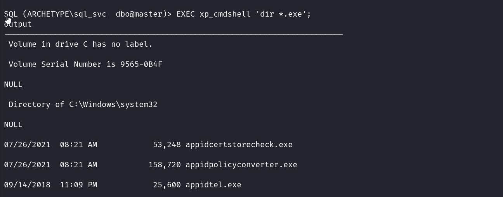
Let's also try a command to see the current user [ whoami ]
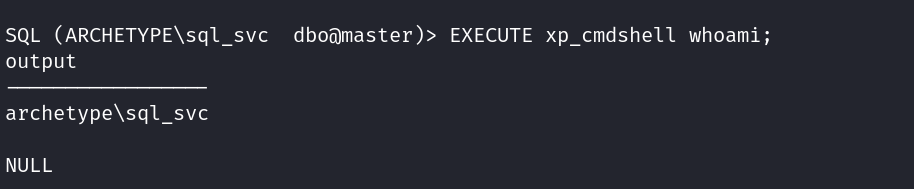
As we can see xp_cmdshell is working successfully now.

We will also establish a reverse shell using netcat.
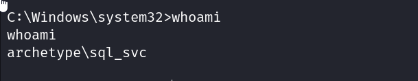
we've succesfully established a reverse shell.

task6: 
To search possible paths to escalate windows privilages we use the WinPEAS script.
we install it on our machine then send it to our target using curl or wget. Then we run it there.
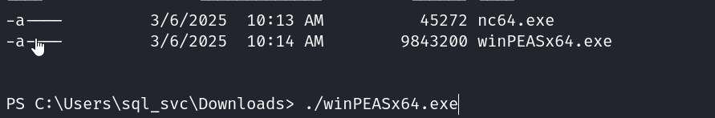
Now for me on running winPEAS script unlike other walkthroughs I didn't get the file under the file analysis.
But if we scan through the data closely we find that the powershell setting section has the path for a powershell
history file which is intersting.
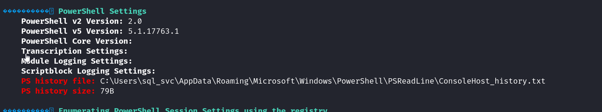
If we check the contents of that file we see that it has a admin username and password.
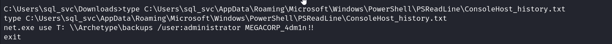

our user flag is in the desktop which we can go throught the reverse shell we made.
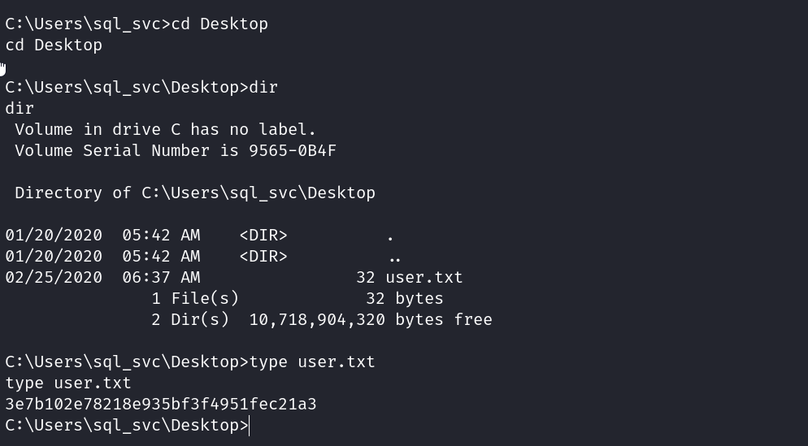

For our root flag let's try to connect as administrator using that username and password we found in the 
console_history.txt.

We successfully manage to connect.
Now generally the flags are in the Desktop so let's check there.
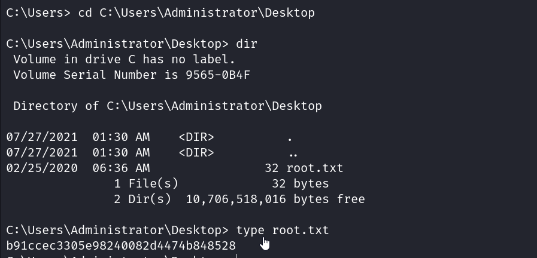
We get the root.txt there as expected and on checking the contents we can get the flag.