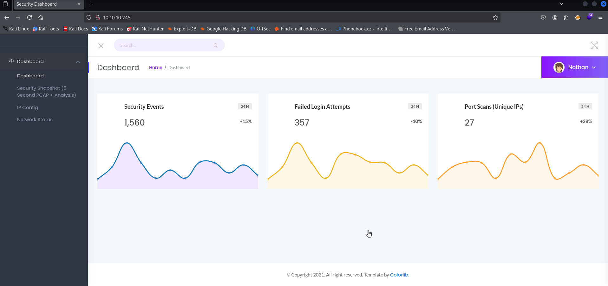

# Cap [MACHINE]

 

### <u>Level:</u> Easy

This is the first machine i've done in HTB other than the starting point.
  
To begin with I spawn the machine and then just ping it to confirm we are connected. I also conduct an nmap scan to see the services running on the ports.  

  
there is an ftp and ssh session. I initially thought i'd try anonymous login but it didn't work. SSH session can't be started without any key. There was also http service running on port 80. SO i entered the url into the browser.
I was directed to this site. 

  
The site has a user profile and seems to be able to monitor and give information regarding the users network. Like when we go to the Network status option, we can see the output of a netstat command. In fact the url itself mentions the netstat command. 

 Similarly, the IP config option gives us the result of an ifconfig.  
On clicking on the security snapshot we are redirected to the dashboard and we see some information such as number of packets sent, number of ip packets etc.   
There is also a donwnload option which gives us a packet capture file that we can go through using wireshark. 
  
I was a bit lost after this as I didn't do what do to immediately. Therefore i went to the guided mode and there they had asked the question "Are you able to get to other users' scans?" and the hint was "Try modifying the URL and see what happens. You could also fuzz with a tool like ffuf or wfuzz."  
So i used fuff on the scan output page url to get this... 

I see that all of the directories we enumerated are numbers. On going to those URL's i notice changes in the output of the scan which implies that i'm accessing the scan results of other users. I had noticed among the different directories there was a 0. I went through some other ones but most of them gave me 0 for all the fields in the scan.So i download the results of the 0 directory URL and then use wireshark again to go through it. 
This is what it somewhat looks like.. 

  
On searching through these packets I come across a series of requests for a login. And these request's contain some sensitive information. 

 Therefore i've now acquired the username and password that i can use to access the ftp hopefully.  
We can use this to access both ssh and ftp. And ssh is the way to go since the aim is to implement a reverse shell that can help us get the flag in the system. That execution of file can be done only in ssh and not in ftp. However I did waste a bit of time in ftp. The user flag i got though and then i went and logged into the ssh session

 
for some reason i'm not able to log into the session right now but I had done it earlier when i completed the lab. After ssh i can access the root and i'm allowed to write into that present folder. I run linpeas in the ssh session and get the information of the ubuntu machine where it is mentioned that python is given permission to changed uid. So i write a script and send it to through ssh and then execute it which changed the uid to 0 that is the id of root which gives me access to the root flag.
and the machine is done.