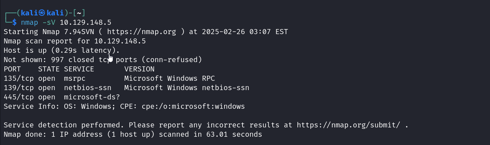
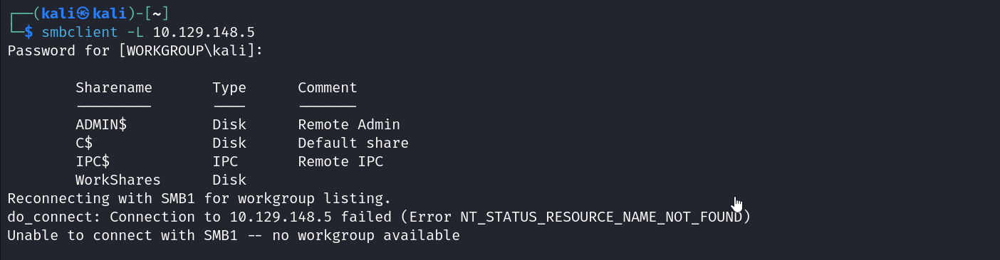

Similar to the fawn and meow ctf this is very easy difficult and is from starting point.

This ctf's theme was on smb or server message block which is used for things like file transfer.

task 1 was a theory question to expand SMB.

task 2 and 3 was to find port and service name, this can be done by a nmap scan.

task 4 and 5 involved finding the available shares on Dancing server.

There were a total of 4 shares. 3 private and 1 public.

Task 6 asked which share could be accessed without using a password. That would be the public share WorkShares. 
We connect to that share using smbclient and then on navigating through it we find the flag.txt which can be downloaded using get command.
Task 7 asked the command to download from SMB shell.

The flag could thus be downloaded and read.
