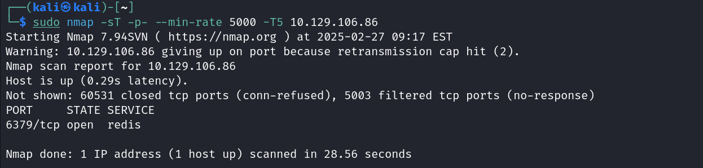
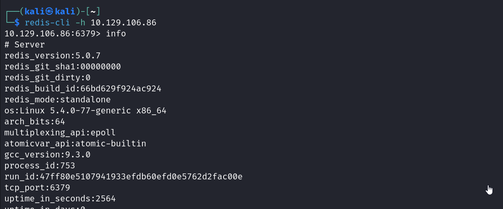
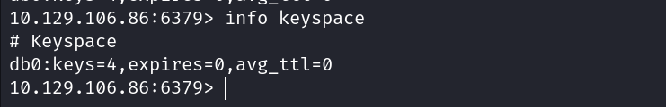
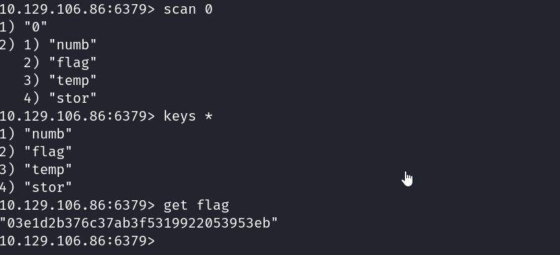

This ctf is at very easy difficulty from starting point tier 0.
It's based on the redis DBMS.

The task begins with trying to identify the tcp port on the machine which is connected to a server and is running redis service. This was the task1 and 2.
This could be found by a nmap scan on all ports.

Task 3 was a theory question.

task 4,5,6,7,8,9,10 involved interacting with the redis server. And finding the information about the server including the version of redis it was running. Also to check the keys in it and obtain all the keys in a database.

We connect to the redis server by specifying the host name with our given ip using the -h flag with the redis command line utility. We also get the info regarding the server using the info command.

In all the info if we check under the keyspace section we can find the number of keys in DB with index 0 (task 9). Or we can also just enter "info keyspace" to get information on the keys and databases.

Now we need to find the flag. We can see all the keys in a database by using "scan 0" or "key *".
On doing that we see a key with name flag. We use the "get" command to extract the value of the key. And therefore get the value of flag.
