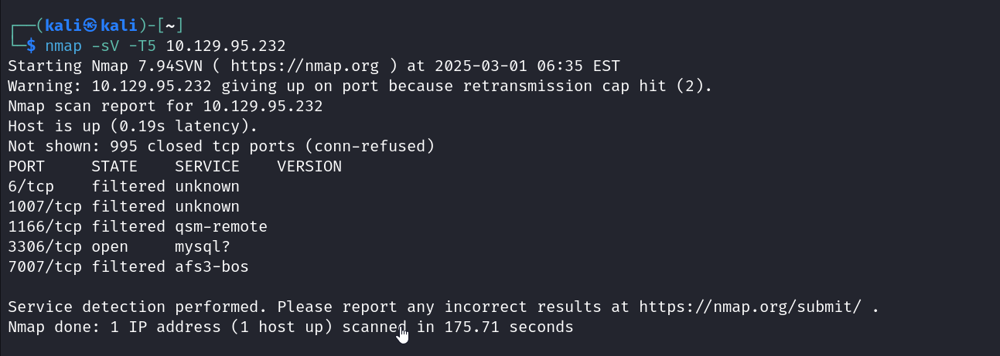
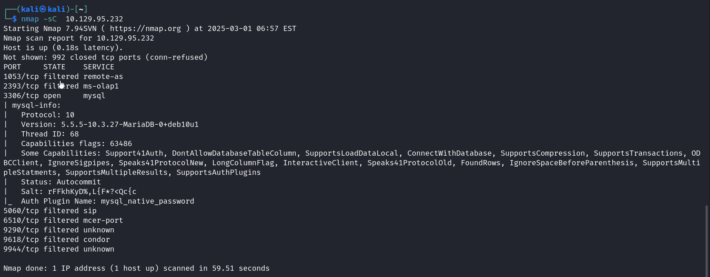
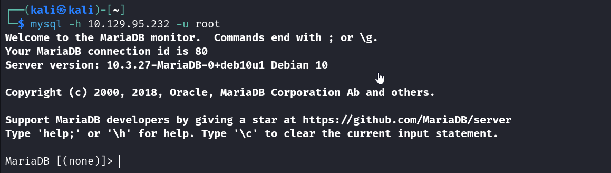
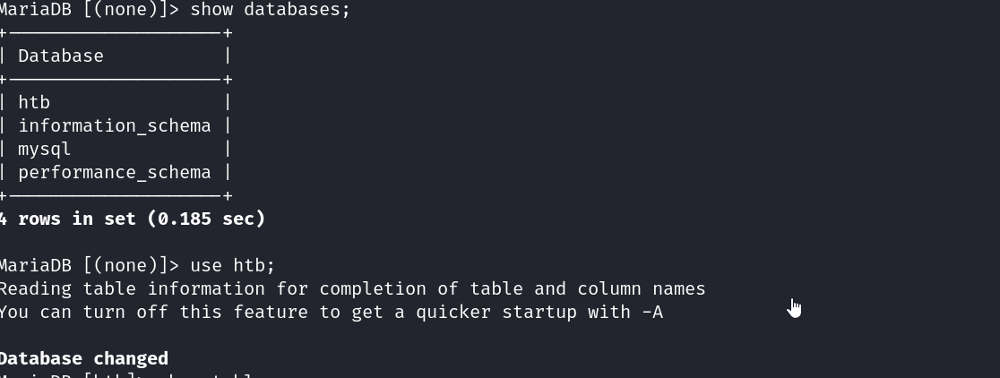
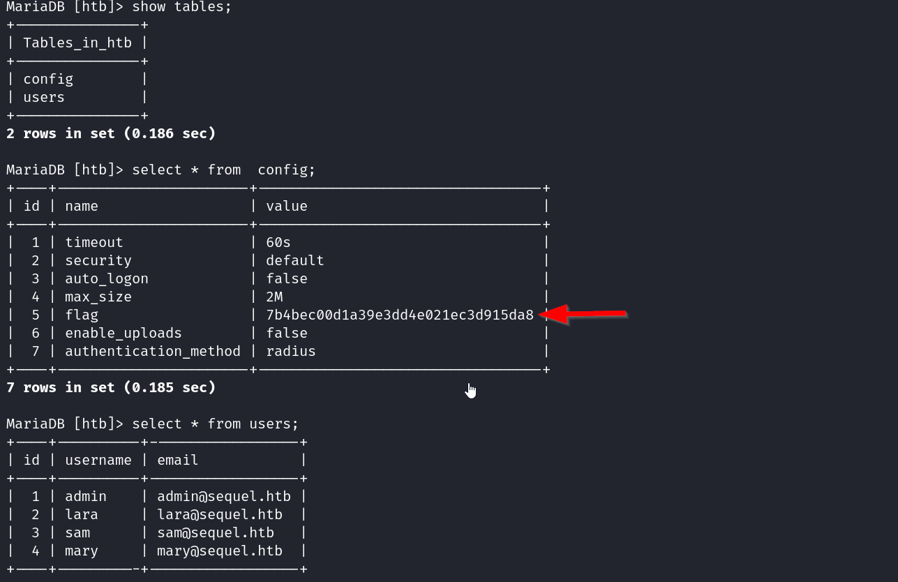

This is a ctf of very easy difficulty from tier 1 starting point.

This ctf is also on mysql and vulnerabilities through it.
There are 8 tasks.

Task 1 asks us to find the port serving MySQL
we can find this my a nmap scan

we see that it is running on port 3306

However the version wasn't displayed so we use '-sC' instead of '-sV'
Task 2 is to find the version
so using nmap again with -sC we can find the version to be mariadb

task 3,4,5,6 are theory questions which involve some mysql questions
we first connect to the mysql server through the MySQL command line client

task 7 is to find the database which is unique to the host. On checking the databases on the server we find a database called htb. That's the only possible one.

Now to find the flag. There are two tables in the htb database -  config and users. On using select to see the data from both we notice that the 'config' table has a tuple flag with a value. Thus we've got the value of the flag.(The flag is pointed to by the arrow)
