This is the ctf named "three" from tier 1 starting point and it has difficulty very easy.

First connect to the network using openvpn. 

task1: To find the the number of open tcp ports we just do a nmap scan
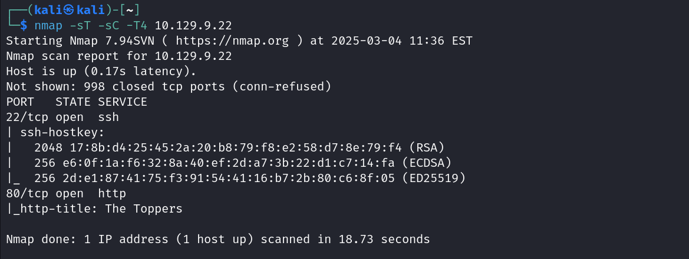
We can see that there are 2 open TCP ports.

task2:
on visiting the ip address in browser we can go to the contacts section and the email is given there.
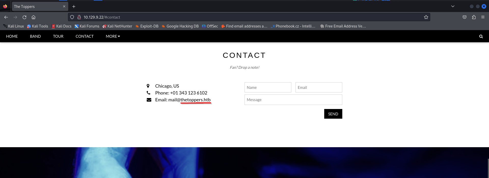

task3:
Like we did in the previous CTF (responder), in the absence of a DNS server we use the "hosts" file in the "etc" folder to resolve hostnames to IP addresses in order to be able to access the websites that point towards the hosts names.

so let's add the domain we found in the email to the hosts file.
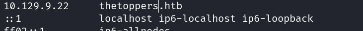

task4: on using gobuster with vhost we get a subdomain s3.thetoppers.htb.
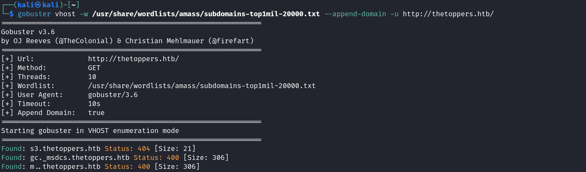
we add that also to the hosts file.
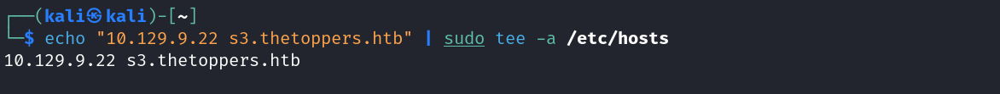

task5:
The service running on the discovered subdomain is amazon s3 which is a cloud storage service.

task6:The Command line utility used to interact with service is aws cli

task7:
The command used to set up AWS CLI installation is aws configure
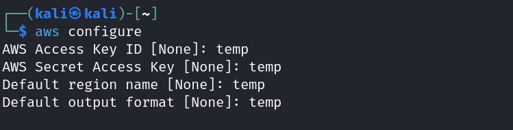

task8: 
We use the aws s3 ls command to list buckets. Along with that we use --endpoint-< url >  to set target as my url.
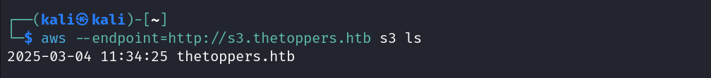

task9:
Now if we use the following command we can list all objects and prefixes in bucket.
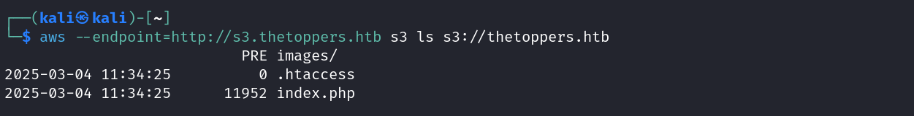
We can see it having a php file. Therefore the web scripting language in question is php.
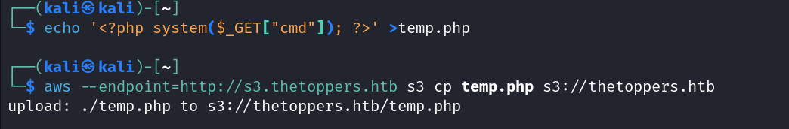

Now if we go to our webpage and try to visit the url with temp.php followed byu ?cmd=< our command >
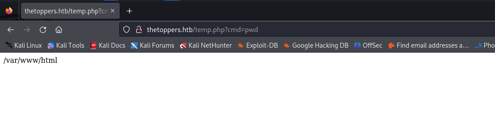
here we can see the present working directory command works
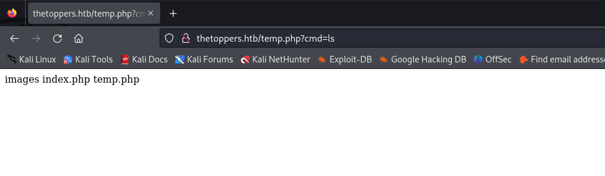
and so does list..
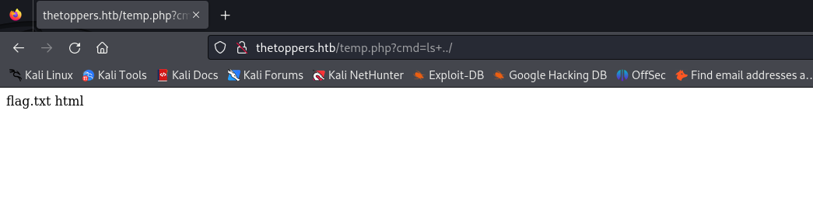
Now when we do cd .. and ls we see our flag.txt file. There we very simply need to go back and get the contents of that file.
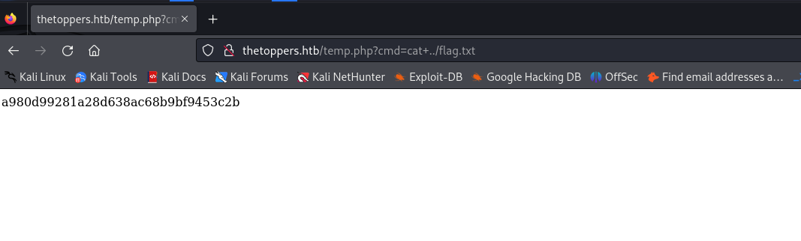
And flag is obtained.