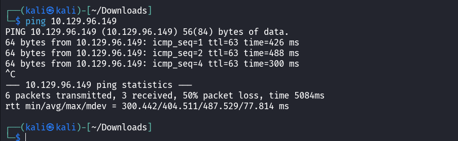
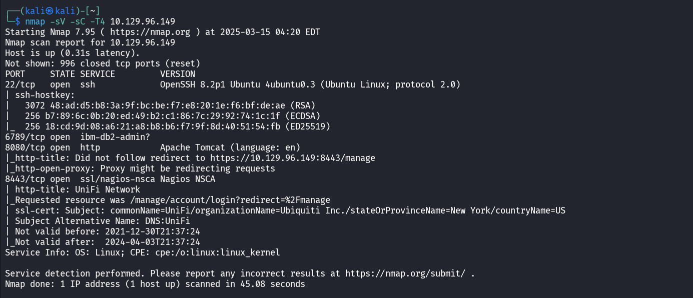
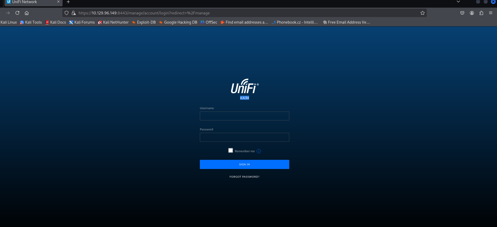
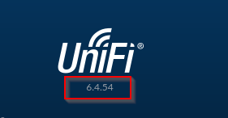
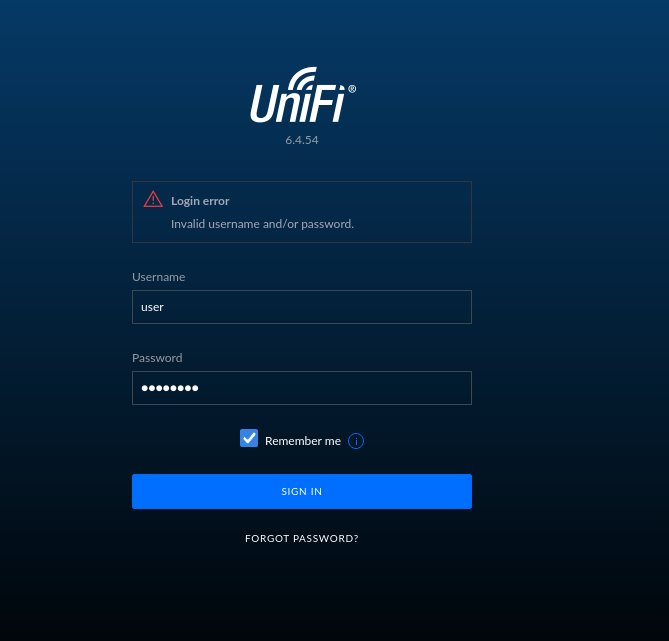

I am doing the unified CTF from hackthebox today. It is the last of the tier2 free challenges from starting point. The last one was also kinda difficult, hopefully i can do this better.

To begin I connect to the network through openVPN and then see if my target is up and running.

Ping return is positive so the machine is up.

On running a simple nmap scan we are able to get the answers for task1 and task2. 

They've asked us the version number in task3..
Now if we visit the site through our link that we got during the nmap scan we reach here

If we look under the unfiy logo we will see the version number we are looking for...

task3:The vulnerability we are exploiting is the Log4j vuleneratbility...it has a CVE CVE-2021-44228

Let's give some random username and password at the login page. 

If we go to burpsuite we will see that we have a request for that in the http history section.It will have the username and password we had entered. We send that request to our repeater.