This is the vaccine.md challenge from hackthebox starting point tier 2. This is also rate very easy, but so far the very easy have been very hard for me in tier 2. We'll see how this one goes.

There are 9 tasks in this so let's begin my first connecting to the network using open vpn and checking if our target machine is up and running.
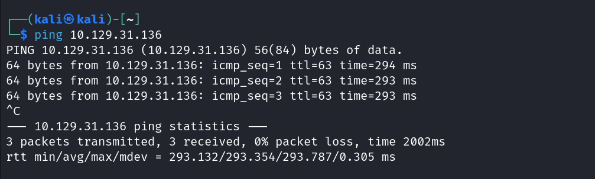
Our target is up and running so let's commence with the tasks.

task1: To check this we run a nmap scan.
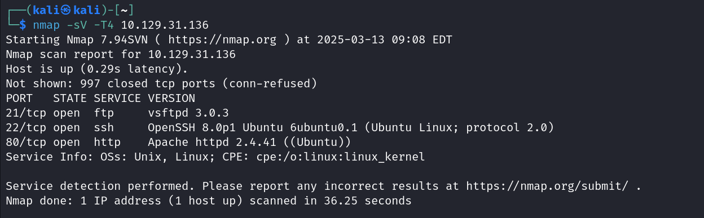
As we can see the service running that isn't mentioned in the task question is ftp.

task2:
The username we use for loging without specific password is "anonymous"
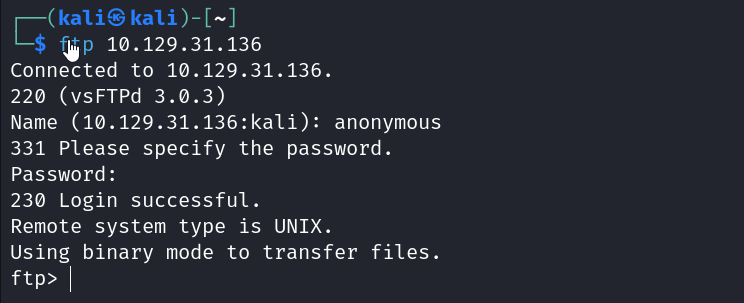

task3:
The file we see on the ftp server is called "backup.zip" we can download that to our local host using "get" command.
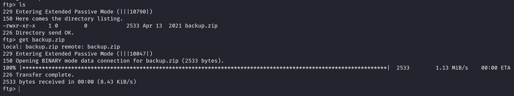

task4:
We initially need to generate a hash from the zip archive and we use the "zip2john" to do it.
We can get the hash...
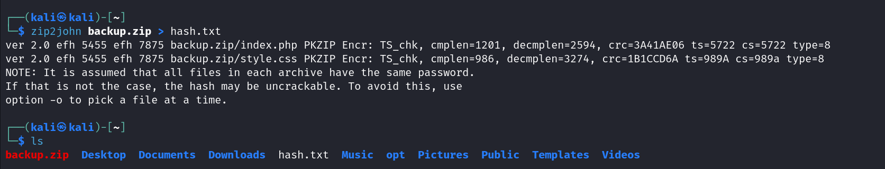
use john the ripper to extract the password from the  hash. Once we do that we are able to unzip the zipped file which contains a index.php and style.css...
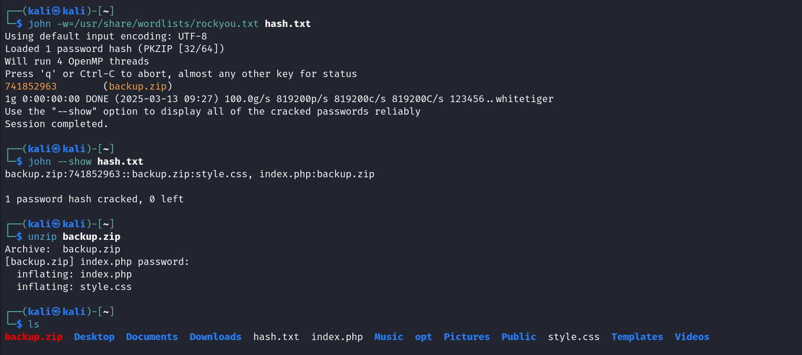

task5:
Our task is to find the password for the "admin" user on the website given..Let's first take a look at the site...
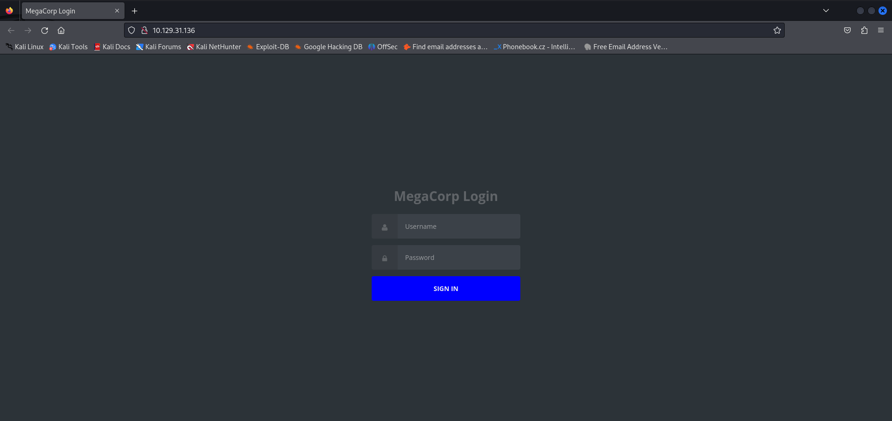
Let's take a look throught the source code we have in the index.php file first...
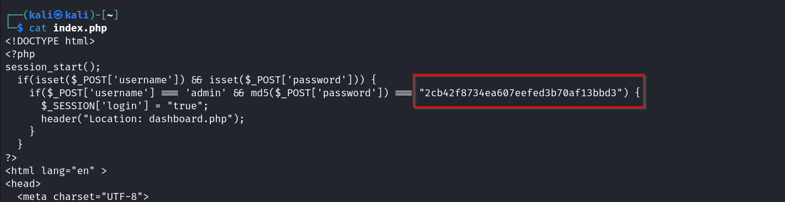
We can see that in there for a username 'admin' we are given a password. But the password isn't given directly. We can use John the RIpper to crack this hash too.
We see that the hash is of type MD-5 so we set format as that while using the john the ripper tool.
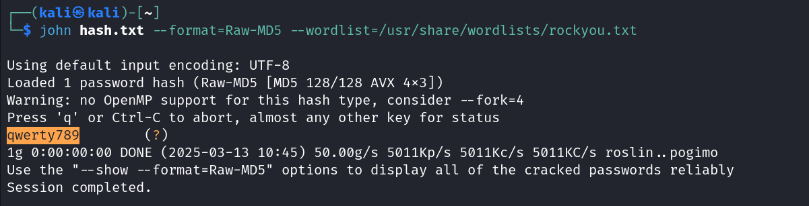
The password is the highlighted part.

We can try to login using these newly learned credentials...
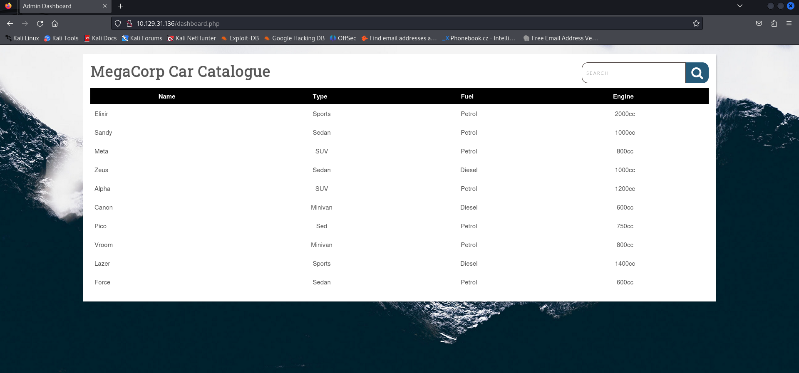
Yes! now we've successfully logged in...

task6:
The option in questions is the "--os-shell" option.
Now we will use sqlmap to get vulnerability and try to run a shell..
we get the cookie value through burpsuite by intercepting a request..
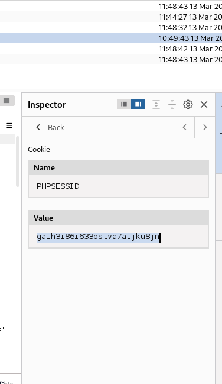
On using this cookie value and our url for the search we get
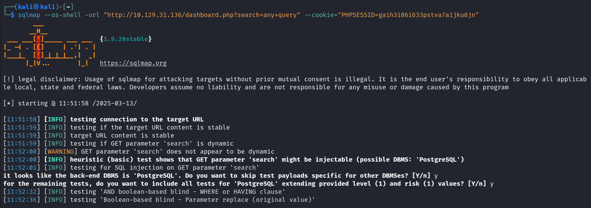
After it runs we can enter the shell
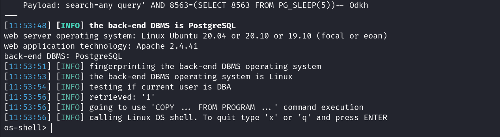
Let's establish a reverse shell for convinience...

task7:
once we establish our reverse shell we need to find the password for postgres user... if we go to the var/www/html and browse throught the files there we will get it...
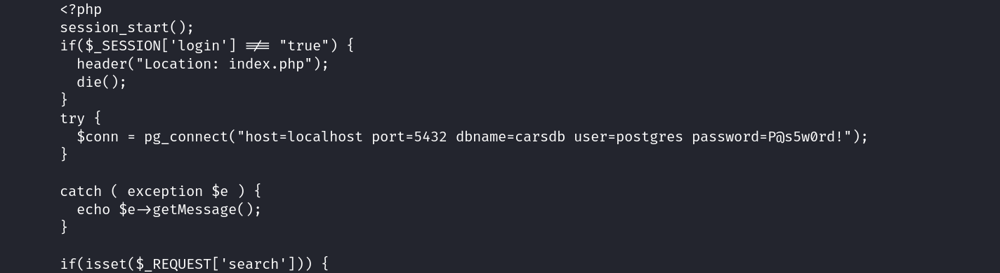
using this and ssh let's log in and then go through the privileges the user has.
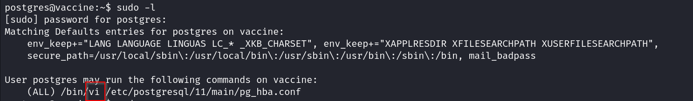
The vi program can be run

userflag can be found in the var/lib/postgressql

to find root flag we use vi and enter as root..thereby we can get the rootflag

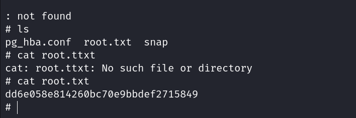